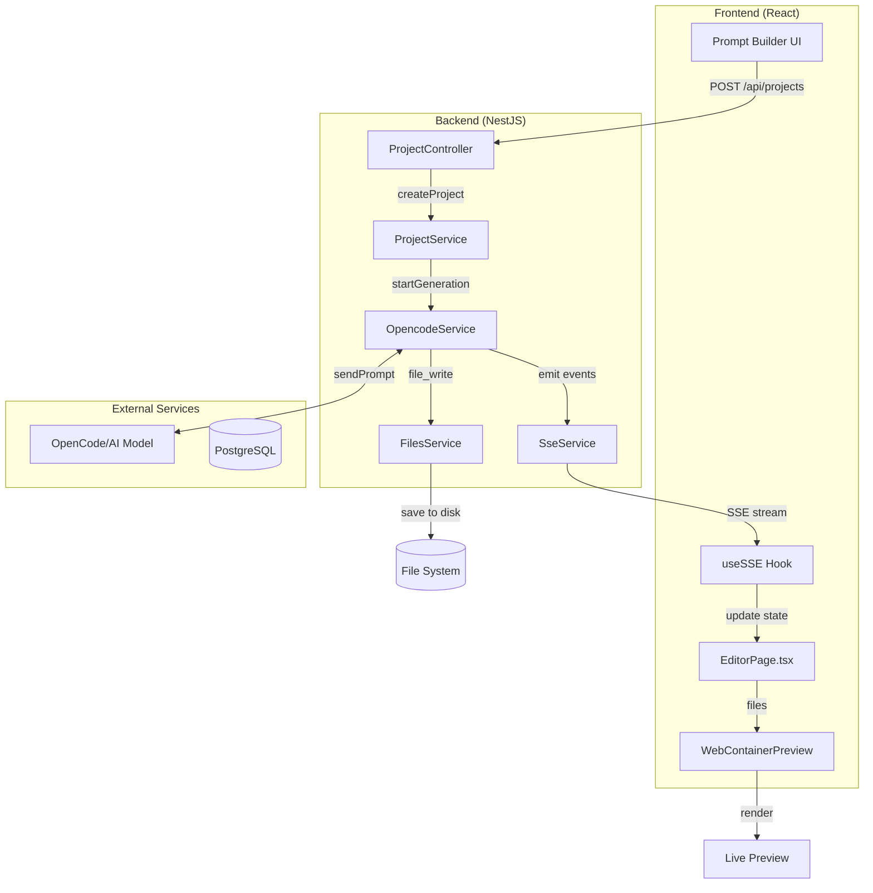

# Weblo Code Generation Process - Complete Guide

> A beginner-friendly guide explaining how user prompts become working React applications

## Table of Contents

1. [Overview](#overview)
2. [Architecture Diagram](#architecture-diagram)
3. [Step 1: Project Creation](#step-1-project-creation)
4. [Step 2: OpenCode AI Service](#step-2-opencode-ai-service)
5. [Step 3: Prompt Building](#step-3-prompt-building)
6. [Step 4: AI Code Generation](#step-4-ai-code-generation)
7. [Step 5: File Storage](#step-5-file-storage)
8. [Step 6: Real-time Updates (SSE)](#step-6-real-time-updates-sse)
9. [Step 7: Frontend Loading](#step-7-frontend-loading)
10. [Step 8: WebContainer Preview](#step-8-webcontainer-preview)

---

## Overview

The Weblo application generates React websites from natural language prompts using AI. Here's the simplified flow:

```
User Prompt → Backend → AI (OpenCode) → Generated Files → WebContainer → Live Preview
```

### Key Technologies
- **Backend**: NestJS (Node.js framework)
- **AI**: OpenCode SDK (wraps OpenRouter/various AI models)
- **Frontend**: React + Vite
- **Preview**: WebContainer (browser-based Node.js runtime)
- **Real-time**: Server-Sent Events (SSE)

---

## Architecture Diagram



---

## Step 1: Project Creation

When a user clicks "Generate" on the frontend, it starts here.

### Frontend: Sending the Request

**File: `frontend/src/store/slices/projectSlice.ts`**

```typescript
// This async thunk sends the project creation request
export const createProject = createAsyncThunk(
    'project/create',
    async ({ name, prompt, preferences }, { rejectWithValue }) => {
        try {
            // POST request to backend API
            const response = await apiInstance.post('/projects', {
                name,        // Project name (e.g., "My Landing Page")
                prompt,      // User's description (e.g., "Create a modern landing page...")
                preferences  // Optional settings (colors, features, etc.)
            });
            return response.data.data || response.data;
        } catch (error) {
            return rejectWithValue(getErrorMessage(error));
        }
    }
);
```

**What happens:**
1. User fills out the Prompt Builder form
2. Clicks "Generate Website"
3. Frontend dispatches `createProject` action
4. HTTP POST request goes to `/api/projects`

---

### Backend: Receiving the Request

**File: `backend/src/modules/project/project.controller.ts`**

```typescript
@Controller('api/projects')
export class ProjectController {
    
    @Post()  // Handles POST /api/projects
    async createProject(
        @Request() req,
        @Body() body: {
            name: string;
            prompt: string;
            preferences?: any;
        },
    ) {
        try {
            // 1. Validate input
            if (!body.name || body.name.trim().length === 0) {
                throw new BadRequestException('Project name is required');
            }

            const userId = req.user?.id || 'test-user-1';
            
            // 2. Call ProjectService to create the project
            const project = await this.projectService.createProject(
                userId,
                body.name.trim(),
                body.prompt.trim(),
                body.preferences
            );

            // 3. Save initial prompt to conversation history
            await this.conversationService.addMessage(
                project.id,
                'user',
                body.prompt,
                { type: 'initial_prompt', preferences: body.preferences }
            );

            return {
                success: true,
                data: project,
                message: 'Project created successfully',
            };
        } catch (error) {
            // Error handling...
        }
    }
}
```

**Key Points for Beginners:**
- `@Controller('api/projects')` - Defines the base URL path
- `@Post()` - This method handles POST requests
- `@Body()` - Extracts the JSON body from the request
- `@Request()` - Gives access to the HTTP request object

---

### Backend: Project Service

**File: `backend/src/modules/project/project.service.ts`**

```typescript
@Injectable()
export class ProjectService {  
    
    async createProject(
        userId: string,
        name: string,
        prompt: string,
        preferences?: any
    ): Promise<Project> {
        
        // 1. Create project record in database
        const project = await this.prisma.project.create({
            data: {
                userId,
                name,
                originalPrompt: prompt,
                preferences: preferences ? JSON.stringify(preferences) : null,
                status: 'PENDING',  // Initial status
                progress: 0,
            },
        });

        // 2. IMPORTANT: Start generation in background (non-blocking)
        this.startGeneration(project.id, prompt, preferences)
            .catch(err => {
                this.logger.error(`Generation failed: ${err.message}`);
            });

        // 3. Return immediately (don't wait for generation)
        return project;
    }
    
    // This runs in the background
    async startGeneration(projectId: string, prompt: string, preferences?: any) {
        try {
            // Update status to GENERATING_CODE
            await this.prisma.project.update({
                where: { id: projectId },
                data: { status: 'GENERATING_CODE', progress: 10 },
            });

            // Call OpenCode service to generate the code
            await this.opencodeService.generateReactProject(
                projectId,
                prompt,
                preferences
            );

            // Update status to COMPLETED
            await this.prisma.project.update({
                where: { id: projectId },
                data: { status: 'COMPLETED', progress: 100 },
            });
            
        } catch (error) {
            // Update status to FAILED
            await this.prisma.project.update({
                where: { id: projectId },
                data: { status: 'FAILED' },
            });
        }
    }
}
```

**Why background processing?**
- Generation takes 30-60 seconds
- User would wait too long if we blocked
- Instead, we return immediately and use SSE for updates

---

## Step 2: OpenCode AI Service

This is the heart of the generation process. It communicates with AI models.

**File: `backend/src/modules/opencode/opencode.service.ts`**

### Service Initialization

```typescript
@Injectable()
export class OpencodeService implements OnModuleInit {
    private opencode: any = null;  // OpenCode SDK instance
    private isReady = false;
    
    // Called automatically when NestJS module starts
    async onModuleInit() {
        await this.initializeOpenCode();
    }
    
    private async initializeOpenCode() {
        // 1. Kill any existing process on port 4096
        await this.killProcessOnPort(4096);
        
        // 2. Start OpenCode server in background
        this.opencodeProcess = spawn('opencode', ['serve'], {
            cwd: process.cwd(),
            env: {
                ...process.env,
                OPENCODE_MODEL: 'openrouter/google/gemini-flash-1.5',
            },
        });
        
        // 3. Wait for server to be ready
        await this.waitForServer();
        
        // 4. Create OpenCode client
        const { createClient } = await import('@opencode-ai/sdk');
        this.opencode = createClient({
            baseUrl: 'http://127.0.0.1:4096',
            .
        });
        
        this.isReady = true;
        this.logger.log('✅ OpenCode service initialized');
    }
}
```

**What is OpenCode?**
- OpenCode is an SDK that provides a unified interface to various AI models
- It runs as a local server on port 4096
- Supports multiple AI providers (OpenRouter, Anthropic, etc.)

---

## Step 3: Prompt Building

The system builds a detailed prompt for the AI based on user preferences.

### Building the Prompt

**File: `backend/src/modules/opencode/opencode.service.ts`**

```typescript
private buildPromptFromPreferences(userPrompt: string, preferences: any): string {
    // 1. Detect if user wants multiple pages
    const isMultiPage = this.detectMultiPageIntent(userPrompt, preferences);
    
    // 2. Get theme and design style
    const theme = preferences?.colors?.primary || 'blue';
    const designStyle = this.getDesignStyle(preferences?.style || 'modern');
    
    // 3. Build the comprehensive prompt
    return `
═══════════════════════════════════════════════════
🎯 PROJECT TYPE: ${isMultiPage ? 'Multi-Page React App' : 'Single-Page App'}
═══════════════════════════════════════════════════

USER REQUEST: ${userPrompt}

═══════════════════════════════════════════════════
📦 REQUIRED FILES TO CREATE
═══════════════════════════════════════════════════

1. package.json - Dependencies
2. vite.config.js - Vite configuration  
3. tailwind.config.js - Tailwind CSS config
4. postcss.config.js - PostCSS config
5. index.html - Entry HTML file
6. src/main.jsx - React entry point
7. src/index.css - Global styles
8. src/App.jsx - Main App component
9. src/components/*.jsx - All components

═══════════════════════════════════════════════════
💎 STYLING REQUIREMENTS
═══════════════════════════════════════════════════

• Use ONLY Tailwind CSS
• Theme: ${theme}
• Style: ${designStyle.description}
• Fully responsive (mobile-first)

═══════════════════════════════════════════════════
⛔ CRITICAL: IMPORT RULES (STRICT ENFORCEMENT)
═══════════════════════════════════════════════════

RULE #1: EVERY JSX FILE MUST IMPORT EVERY COMPONENT IT USES

❌ BAD (will crash):
   const Home = () => (<div><Hero /></div>);  // NO IMPORT!

✅ GOOD (works):
   import Hero from "../components/Hero";
   const Home = () => (<div><Hero /></div>);

═══════════════════════════════════════════════════
✅ EXECUTION RULES  
═══════════════════════════════════════════════════

✓ Use file_write tool for EVERY file
✓ Write COMPLETE code (no truncation)
✓ Create ALL component files BEFORE App.jsx
✓ VERIFY: Every <Component /> has a matching import
    `;
}
```

**Why such detailed prompts?**
- AI models need clear, specific instructions
- Without strict rules, AI often forgets imports
- The prompt acts as a contract for what the AI should produce

---

## Step 4: AI Code Generation

Now we actually send the prompt to the AI and get code back.

### Sending to AI

```typescript
async generateReactProject(
    projectId: string,
    userPrompt: string,
    preferences?: any
): Promise<void> {
    
    // 1. Get or create a session for this project
    const session = await this.getOrCreateSession(projectId);
    const projectPath = session.projectPath;  // e.g., /storage/projects/abc123/sessions/ses_xyz
    
    // 2. Build the detailed prompt
    const fullPrompt = preferences
        ? this.buildPromptFromPreferences(userPrompt, preferences)
        : this.buildReactPromptFilesOnly(userPrompt, null, projectPath);
    
    // 3. Send prompt to AI via OpenCode SDK
    this.logger.log('🤖 Sending prompt to AI...');
    
    const response = await this.opencode.sendPrompt({
        sessionId: session.opencodeSessionId,
        prompt: fullPrompt,
    });
    
    // 4. AI executes tools (file_write) automatically
    // The AI will call file_write for each file it generates
    
    // 5. Emit completion event
    this.sseService.emit(projectId, 'generation_completed', {
        message: 'Generation completed successfully',
        filesGenerated: await this.countFiles(projectPath),
    });
}
```

### How AI Generates Files

The AI doesn't just return text - it executes **tools**. When the AI wants to create a file, it calls the `file_write` tool:

```
AI Response (internal):
{
  "tool": "file_write",
  "arguments": {
    "path": "/storage/projects/abc123/.../src/App.jsx",
    "content": "import { useState } from 'react';\n\nfunction App() {\n  return (\n    <div>Hello World</div>\n  );\n}\n\nexport default App;"
  }
}
```

The OpenCode SDK automatically handles this and writes to your file system.

---

## Step 5: File Storage

Files are stored on disk in a structured directory.

### Directory Structure

```
backend/storage/projects/
└── cmji6at1q0000czmt35n3wimf/     # Project ID
    └── sessions/
        └── ses_4b6374fc4ffeQdkUoG09q0iMxh/  # Session ID
            ├── package.json
            ├── vite.config.js
            ├── tailwind.config.js
            ├── postcss.config.js
            ├── index.html
            └── src/
                ├── main.jsx
                ├── index.css
                ├── App.jsx
                └── components/
                    ├── Header.jsx
                    ├── Hero.jsx
                    ├── Footer.jsx
                    └── ...
```

### Reading Files for API

**File: `backend/src/modules/files/files.service.ts`**

```typescript
@Injectable()
export class FilesService {
    
    // Read all files recursively from a project
    async readProjectFiles(projectId: string, sessionId: string): Promise<any[]> {
        const projectPath = path.join(
            this.STORAGE_ROOT,
            projectId,
            'sessions',
            sessionId
        );

        if (!(await fs.pathExists(projectPath))) {
            return [];
        }

        return this.readProjectFilesRecursive(projectPath);
    }
    
    // Recursively read all files
    private async readProjectFilesRecursive(
        directory: string,
        basePath = ''
    ): Promise<Array<{ filename: string; content: string }>> {
        
        const files: Array<{ filename: string; content: string }> = [];
        const entries = await fs.readdir(directory, { withFileTypes: true });

        for (const entry of entries) {
            const fullPath = path.join(directory, entry.name);
            // Build relative path with forward slashes (important for web)
            const relativePath = basePath ? basePath + '/' + entry.name : entry.name;

            if (entry.isDirectory()) {
                // Skip node_modules, dist, .git
                if (['node_modules', 'dist', '.git'].includes(entry.name)) {
                    continue;
                }
                // Recurse into subdirectories
                const subFiles = await this.readProjectFilesRecursive(fullPath, relativePath);
                files.push(...subFiles);
            } else if (entry.isFile()) {
                // Read file content
                const content = await fs.readFile(fullPath, 'utf-8');
                files.push({
                    filename: relativePath,  // e.g., "src/App.jsx"
                    content,                  // The actual file content
                });
            }
        }

        return files;
    }
}
```

**Output format:**
```javascript
[
  { filename: "package.json", content: "{ \"name\": \"weblo-app\", ... }" },
  { filename: "src/main.jsx", content: "import React from 'react';\n..." },
  { filename: "src/App.jsx", content: "function App() { ... }" },
  { filename: "src/components/Hero.jsx", content: "function Hero() { ... }" },
  // ... more files
]
```

---

## Step 6: Real-time Updates (SSE)

Server-Sent Events (SSE) push updates to the frontend in real-time.

### Backend SSE Service

**File: `backend/src/modules/sse/sse.service.ts`**

```typescript
@Injectable()
export class SseService {
    // Map of projectId -> Subject (observable stream)
    private subjects = new Map<string, Subject<any>>();
    
    // Create or get a stream for a project
    getStream(projectId: string): Observable<any> {
        if (!this.subjects.has(projectId)) {
            this.subjects.set(projectId, new Subject());
        }
        return this.subjects.get(projectId)!.asObservable();
    }
    
    // Emit an event to all listeners of a project
    emit(projectId: string, eventType: string, data: any) {
        const subject = this.subjects.get(projectId);
        if (subject) {
            subject.next({
                type: eventType,
                data,
                timestamp: new Date().toISOString(),
            });
        }
    }
}
```

### SSE Controller

**File: `backend/src/modules/sse/sse.controller.ts`**

```typescript
@Controller('api/sse')
export class SseController {
    
    @Get(':projectId')
    @Sse()  // This decorator makes it an SSE endpoint
    stream(@Param('projectId') projectId: string): Observable<MessageEvent> {
        return this.sseService.getStream(projectId).pipe(
            map((event) => ({
                data: JSON.stringify(event),
            }))
        );
    }
}
```

### Event Types Emitted

```typescript
// During generation, OpenCode service emits these events:

// 1. When a file is created
this.sseService.emit(projectId, 'file_created', {
    filename: 'src/App.jsx',
    content: '...',
});

// 2. Progress updates
this.sseService.emit(projectId, 'progress', {
    progress: 50,
    message: 'Creating components...',
});

// 3. When generation completes
this.sseService.emit(projectId, 'generation_completed', {
    message: 'Generation completed successfully',
    filesGenerated: 14,
});

// 4. If generation fails
this.sseService.emit(projectId, 'generation_failed', {
    error: 'AI did not create required files',
});
```

---

## Step 7: Frontend Loading

The frontend listens for SSE events and loads files.

### SSE Hook

**File: `frontend/src/hooks/useSSE.ts`**

```typescript
export function useSSE(projectId: string) {
    const [state, setState] = useState<SSEState>({
        events: [],
        status: 'disconnected',
        progress: 0,
        streamingFiles: {},  // Files as they're created
    });

    useEffect(() => {
        if (!projectId) return;

        // Connect to SSE endpoint
        const eventSource = new EventSource(
            `http://localhost:3001/api/sse/${projectId}`
        );

        // Listen for file creation events
        eventSource.addEventListener('file_created', (e) => {
            const data = JSON.parse(e.data);
            setState((prev) => ({
                ...prev,
                streamingFiles: {
                    ...prev.streamingFiles,
                    [data.filename]: data.content,
                },
            }));
        });

        // Listen for completion
        eventSource.addEventListener('generation_completed', (e) => {
            setState((prev) => ({
                ...prev,
                projectStatus: 'completed',
                progress: 100,
            }));
        });

        return () => {
            eventSource.close();
        };
    }, [projectId]);

    return state;
}
```

### Loading Files from API

**File: `frontend/src/pages/EditorPage.tsx`**

```typescript
export default function EditorPage() {
    const [files, setFiles] = useState<Record<string, string>>({});
    
    // Load project files from API
    const loadProjectFiles = async () => {
        const filesArray = await dispatch(fetchProjectFiles(projectId)).unwrap();
        const loadedFiles: Record<string, string> = {};

        // Process the files array
        for (const file of filesArray) {
            if (file.filename && file.content !== undefined) {
                loadedFiles[file.filename] = file.content;
                console.log(`📄 Loaded: ${file.filename}`);
            }
        }

        if (Object.keys(loadedFiles).length > 0) {
            console.log('✅ Loaded files:', Object.keys(loadedFiles));
            setFiles(loadedFiles);  // Set state with all files
        }
    };
    
    // When generation completes, reload files
    useEffect(() => {
        if (projectStatus === 'completed') {
            loadProjectFiles();
        }
    }, [projectStatus]);
    
    // Pass files to WebContainerPreview
    return (
        <WebContainerPreview 
            files={files}
            title={project.name}
            // ...
        />
    );
}
```

---

## Step 8: WebContainer Preview

WebContainer runs a full Node.js environment in the browser!

### What is WebContainer?

- Created by StackBlitz
- Runs Node.js directly in the browser
- No server needed for the preview
- Supports npm, Vite, and more

### How It Works

**File: `frontend/src/hooks/useWebContainer.ts`**

```typescript
export function useWebContainer(files: Record<string, string>) {
    const [status, setStatus] = useState({ phase: 'idle' });
    const [previewUrl, setPreviewUrl] = useState<string | null>(null);
    
    // Convert files to WebContainer format
    const convertToWebContainerFiles = (projectFiles) => {
        const wcFiles = {};
        
        Object.entries(projectFiles).forEach(([path, content]) => {
            // Build nested directory structure
            // "src/App.jsx" becomes:
            // { src: { directory: { "App.jsx": { file: { contents: "..." } } } } }
            
            const parts = path.split('/');
            let current = wcFiles;
            
            for (let i = 0; i < parts.length - 1; i++) {
                if (!current[parts[i]]) {
                    current[parts[i]] = { directory: {} };
                }
                current = current[parts[i]].directory;
            }
            
            const fileName = parts[parts.length - 1];
            current[fileName] = {
                file: { contents: content },
            };
        });
        
        return wcFiles;
    };
    
    // Main initialization
    const initialize = async () => {
        // 1. Boot WebContainer
        setStatus({ phase: 'booting', message: 'Starting WebContainer...' });
        const container = await WebContainer.boot();
        
        // 2. Mount files
        setStatus({ phase: 'mounting', message: 'Mounting files...' });
        const wcFiles = convertToWebContainerFiles(files);
        await container.mount(wcFiles);
        
        // 3. Install dependencies
        setStatus({ phase: 'installing', message: 'Installing dependencies...' });
        const installProcess = await container.spawn('npm', ['install']);
        await installProcess.exit;
        
        // 4. Start dev server
        setStatus({ phase: 'starting', message: 'Starting dev server...' });
        await container.spawn('npm', ['run', 'dev']);
        
        // 5. Wait for server to be ready
        container.on('server-ready', (port, url) => {
            setPreviewUrl(url);
            setStatus({ phase: 'ready', message: 'Ready!' });
        });
    };
    
    // Initialize when files are available
    useEffect(() => {
        if (Object.keys(files).length > 0 && files['package.json']) {
            initialize();
        }
    }, [files]);
    
    return {
        status,
        previewUrl,
        // ...
    };
}
```

### The Preview Iframe

**File: `frontend/src/components/editor/WebContainerPreview.tsx`**

```typescript
export default function WebContainerPreview({ files }) {
    const { status, previewUrl } = useWebContainer(files);
    
    return (
        <div className="h-full">
            {status.phase === 'ready' && previewUrl ? (
                // Show the live preview
                <iframe
                    src={previewUrl}
                    className="w-full h-full border-0"
                    title="Preview"
                />
            ) : (
                // Show loading state
                <LoadingScreen status={status} />
            )}
        </div>
    );
}
```

---

## Complete Flow Summary

```
1. User enters prompt in Prompt Builder UI
         ↓
2. Frontend sends POST /api/projects
         ↓
3. ProjectController receives request
         ↓
4. ProjectService creates DB record, starts background generation
         ↓
5. OpencodeService builds detailed prompt from preferences
         ↓
6. Prompt sent to AI via OpenCode SDK
         ↓
7. AI generates code and calls file_write tool for each file
         ↓
8. Files saved to disk in /storage/projects/{id}/sessions/{sid}/
         ↓
9. SSE events emitted for each file created
         ↓
10. Frontend receives SSE events, updates UI
         ↓
11. On completion, frontend loads all files from API
         ↓
12. Files passed to WebContainerPreview component
         ↓
13. useWebContainer hook:
    a. Boots WebContainer
    b. Mounts files
    c. Runs npm install
    d. Starts Vite dev server
         ↓
14. Preview URL set, iframe shows live website!
```

---

## Debugging Tips

### Check if files exist in backend
```bash
ls -la backend/storage/projects/{projectId}/sessions/{sessionId}/src/
```

### Check API response
```bash
curl http://localhost:3001/api/projects/{projectId}/files | jq
```

### Check browser console for:
- `📄 Loaded:` - Files loaded from API
- `🔍 [WebContainer] File check:` - Files received by WebContainer
- `✅ Mounted X files` - Files mounted to WebContainer

### Common Issues

1. **"Failed to resolve import"** - File exists but not mounted
   - Check if `processFiles` in EditorPage is parsing correctly
   
2. **"package.json missing"** - WebContainer won't initialize
   - Verify API returns package.json in files array

3. **Blank preview** - Files not loading
   - Check SSE connection in Network tab
   - Verify `generation_completed` event was received

---

## Key Files Reference

| File | Purpose |
|------|---------|
| `project.controller.ts` | HTTP endpoints for projects |
| `project.service.ts` | Business logic, starts generation |
| `opencode.service.ts` | AI integration, prompt building |
| `files.service.ts` | File system operations |
| `sse.service.ts` | Real-time event streaming |
| `EditorPage.tsx` | Main editor UI, loads files |
| `useWebContainer.ts` | WebContainer hook |
| `WebContainerPreview.tsx` | Preview component |

---

*Document created for Weblo HTML project - December 2024*
